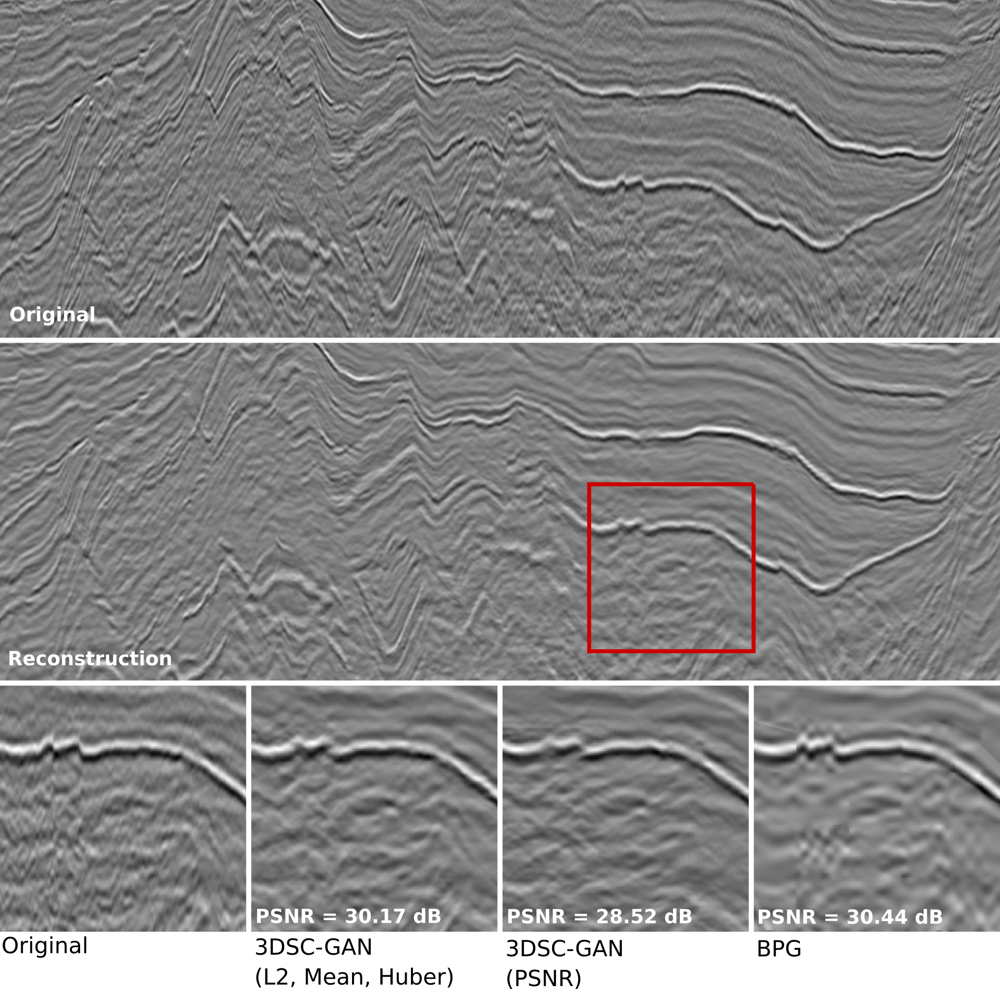

# 3DSC-GAN with Composite Loss Function

TensorFlow implementation for learned compression of 3-D poststack seismic data with Composite Loss Function. The method was developed by Ribeiro et. al. in Composite Loss Function for 3-D Poststack Seismic Data Compression.



-------------------------------------------------

## Data
The method was trained and tested using 3-D poststack seismic volumes from the Society of Exploration Geophysicists (SEG) Open Data repository. All the **original volumes** can be downloaded from this [link](http://www.gcg.ufjf.br/files/3dsc-gan/original_data.zip)

## Getting Started

### Installation
```bash
# Clone
$ git clone https://github.com/GCG-UFJF/3dsc-gan-composite.git
$ cd 3dsc-gan-composite

# Build an image as a container
$ docker build --rm -t 3dsc_gan_composite dockerfiles/

# Run the image as a container
$ docker run -ti --rm --gpus all -v "$(pwd):/workspace" 3dsc_gan_composite bash

# Extract the subvolumes
#  - this step requires the original volumes
#  - verify the path to original_data before running the command
$ python3 data/generate_dataset.py
```

### Train/Test section
```
# Run the image as a container
$ docker run -ti --rm --gpus all -v "$(pwd):/workspace" 3dsc_gan_composite bash

# Train a model
$ cd code/
$ python3 train.py

# Test a trained model
$ cd code/
$ python3 test.py
```


## Citation
If you use this code for your research, please cite the paper.
